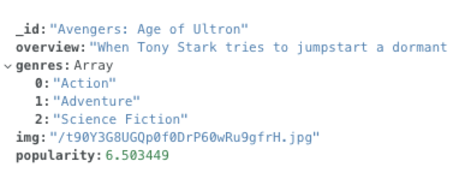
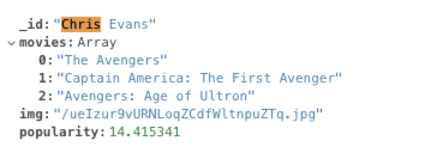
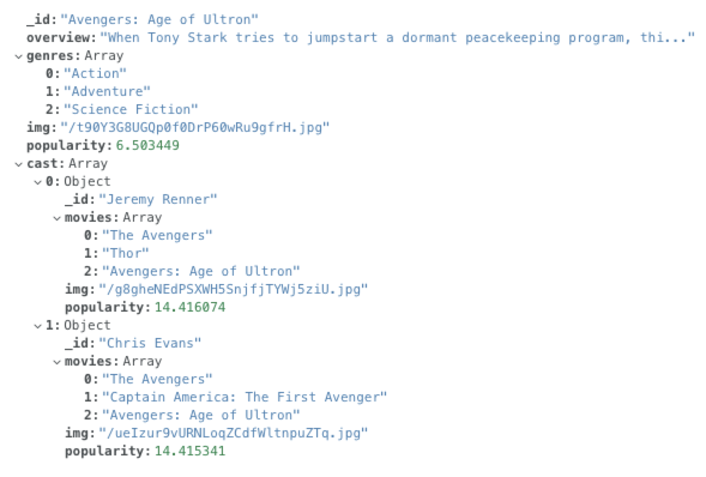

## Introduction
MongoDB is considered the most popular document-type NoSQL database. It has great community support and offers access on many platforms using many programming environments.

## Requirements

- `1.` Set up the free account for MongoDB Atlas on any of the three cloud platforms.

- `2.` Create an admin account for the Cluster with the following credentials:  
        -`a.` Username  
        -`b.` Password
        
- `3.` Create database in your cluster

- `4.` Create collections - movies and people in the database (you will use mongoimport to do and use the credentials to perform the imports. Command can be found in __'Command Line Tools'__ section on Atlas.

- `5.` Process the data to create a new collection called __fullmovies__. This collection contain all the documents in the movies collection, and a new field called __cast__, with an array of the cast data.

- `6.` Write a Python program with a menu system, to do the following, using ONLY the __fullmovie__ collection:  
      -`a.` List all movie titles with only the names of the cast members. (Create an index for this.)  
      -`b.` Ask for a cast member, and display all movies that the member is in. (Create an index for this.)  
      -`c.` Ask for a keyword, and search the "overview" field to return the title and overview for each match. (Create an index for this.)

